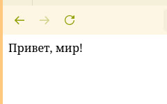
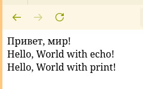
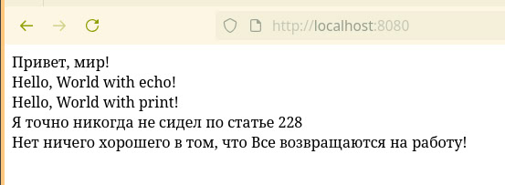

* Йоу йоу пхп вторая лаба йоуйоу йоу йопийоу йопийопийоу хэй

** Установка интерпретатора языка программированя пхп

Для установки интерпретатора этого ужасного языка я буду использовать
свободную систему функционального менеджмента пакетов [[https://guix.gnu.org][GNU Guix]].

Поскольку я не желаю засорять свою систему гадским языком пхп, я буду
запускать это всё в шелле. Чтоб точно воспроизвести среду, в которой я
провожу эту лабораторную работу вы должны:

1. Установить пакетный менеджер [[https://guix.gnu.org][GNU Guix]] одним из предложенных в
   документации методов ([[https://guix.gnu.org/manual/devel/en/html_node/Installation.html][ссылка]])
2. Склонировать данный гит репозиторий командой
   #+begin_src sh
     git clone https://github.com/LesikEdelweiss/phplabs.git -b lab02
   #+end_src
3. Запустить следующую команду
   #+begin_src sh :session phplab02 :results none
     guix time-machine -C channels.scm -- shell -m manifest.scm
   #+end_src

Для проверки установки языка php преподаватель рекомендует запустить
слудующую команду:
 
#+begin_src sh :session phplab02 :results output code :exports both
  php -v
#+end_src

#+RESULTS:
#+begin_src sh
PHP 8.5.2 (cli) (built: Jan  1 1970 00:00:01) (ZTS)
Copyright (c) The PHP Group
Zend Engine v4.5.2, Copyright (c) Zend Technologies
    with Zend OPcache v8.5.2, Copyright (c), by Zend Technologies
#+end_src

Ура, всё работает!!!!

** Теперь к лабораторке

В работе нам нужно запустить парочку простых php скриптиков, и чуть
потыкать код!

*** Задание первое! Хеловролдт

Простенький хеллоувролдтидк пишется вот так:

#+begin_src php :tangle index.php
  <?php
  
  echo "Привет, мир! ";
#+end_src

Запустим встроенный веб сервер командой

#+begin_src sh
  php -S localhost:8080
#+end_src

И посмотрим на результат!

Вау это хеллоуворлд

***  По второму заданию

Надо повыводить всякую чушь, поделаем это пожалйу

#+begin_src php :tangle index.php
  echo "Hello, World with echo! ";
  print "Hello, World with print! ";
#+end_src

Что выводит

*** Третье задание

Необходимо посоздавать переменные, и вывести их разными методами:
конкатинацией и двойными кавычками. Делаем!

#+begin_src php :tangle index.php
  $days = 228;
  $message = "Все возвращаются на работу!";

  echo "Я точно никогда не сидел по статье " . $days;
  echo " Нет ничего хорошего в том, что $message";
#+end_src

Всё вывелось, супер!

** Контрольные вопросы

1. *Какие способы установки PHP существуют?*
   Самые разнообразные, в частности, если описать простыми словами,
   они заключаются в: установке интерпретатора php, как независимого
   субъекта права, или инкорпорирование php, как среды, запускаемой
   неким веб сервером(Apache, Nginx и т.д.)
2. *Как проверить, что PHP установлен и работает?*
   Проверить это можно командой =php -v=, или запуском некоего
   скриптика, просто чтоб потыкать.
3. *Чем отличается оператор =echo= от =print=?*
   Главным образом тем, что =echo= может принимать несколько
   аргументов, разделенных запятыми, =print= всегда возвращает 1,
   когда эхо не возвращает ничего, да вот и всё в целом.

Поставьте 10, прошу.
