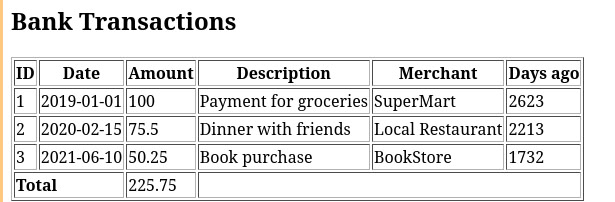

* Лабораторная работа 4
Массивы и функции в PHP

Студент: Пустовой Алексей  
Группа:  IA2404

* Цель работы

Изучить работу с массивами в PHP.  
Научиться выполнять операции добавления, поиска и сортировки элементов.  
Закрепить работу с функциями и файловой системой.

* Задание 1

В первой части лабораторной работы была реализована система банковских транзакций.

Каждая транзакция хранится в виде ассоциативного массива со следующими полями:

- id
- date
- amount
- description
- merchant

Все транзакции хранятся в массиве transactions.

** Реализованные функции

calculateTotalAmount

Функция считает общую сумму всех транзакций.

findTransactionByDescription

Функция ищет транзакции по части описания.

findTransactionById

Функция ищет транзакцию по id используя цикл foreach.

findTransactionByIdFilter

Функция делает то же самое но с использованием array_filter.

daysSinceTransaction

Функция считает сколько дней прошло с момента транзакции.

addTransaction

Функция добавляет новую транзакцию в массив.

sortByDate

Сортирует транзакции по дате используя usort.

sortByAmountDesc

Сортирует транзакции по сумме по убыванию.

** Вывод данных

Все транзакции выводятся в HTML таблицу с помощью цикла foreach.

Также в таблице выводится количество дней с момента транзакции и общая сумма всех транзакций.

* Задание 2

Во второй части лабораторной работы реализована галерея изображений.

Была создана папка image в которой находятся изображения.

Скрипт index2.php сканирует содержимое папки с помощью функции scandir и выводит изображения на страницу.

Каждое изображение выводится с помощью HTML тега img.

* Контрольные вопросы

** Что такое массивы в PHP

Массив это структура данных которая хранит набор значений.  
Каждый элемент массива имеет индекс или ключ.

** Как создать массив в PHP

Массив можно создать с помощью функции array или с помощью квадратных скобок.

Пример:

#+begin_src php
$arr = [1,2,3];
#+end_src

** Для чего используется цикл foreach

Цикл foreach используется для перебора элементов массива.  
Он позволяет по очереди получить каждый элемент массива.

* Вывод

В ходе лабораторной работы я изучил работу с массивами в PHP.  
Я научился создавать функции, работать с датами и сортировать массивы.  
Также я научился выводить изображения из папки на веб страницу.
