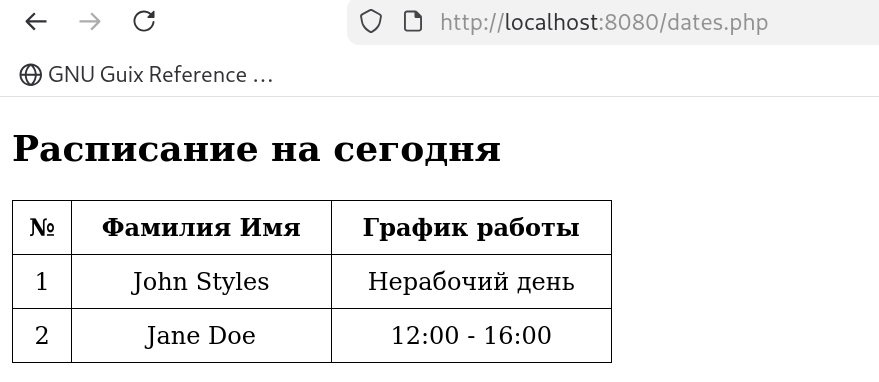
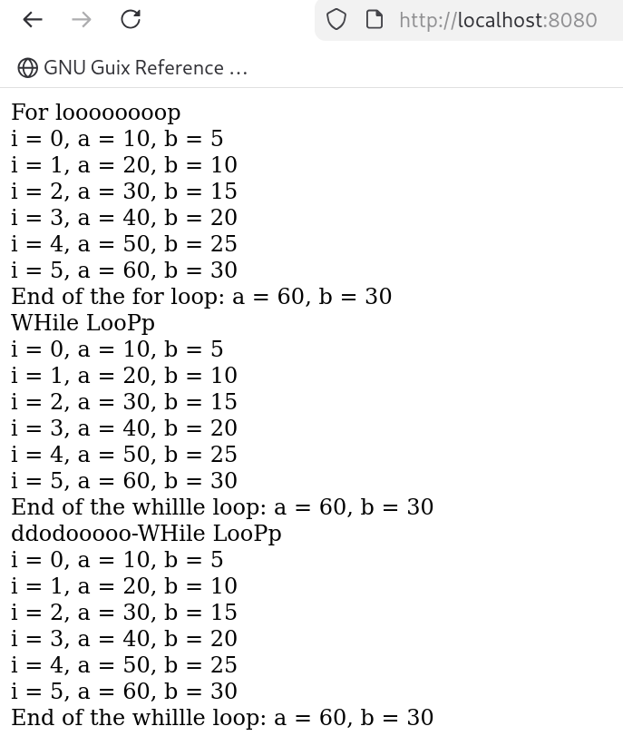

* Йоу йоу пхп лаба 3 дада это реально 3 лаба

** Постановка задачи

Значт, что нам надо сделать, а нам надо создать пхп код, который будет
использовать условные конструкции, ну чтоб изузчить условные
конструкции, условный срок в тюрьме, условная итерационная гильотина,
условие остановки машины Тьюринга, условиться о определенных
соглашениях, обусловленные обстоятельства, условное склонение, условия
использования, условность береговой линии, условно говоря апостол
Пётр, условие.

А потом нам нужно изучить изучить изучить изучить изучить изучить
изучить изучить изучить изучить изучить изучить изучить изучить
изучить изучить изучить изучить изучить изучить изучить изучить
изучить изучить изучить изучить изучить изучить изучить изучить
изучить изучить изучить изучить изучить изучить изучить изучить
изучить изучить изучить изучить изучить изучить изучить изучить
изучить изучить изучить изучить изучить изучить изучить изучить
изучить изучить изучить изучить изучить изучить изучить изучить
изучить изучить изучить изучить изучить изучить изучить изучить
изучить изучить изучить изучить изучить изучить изучить изучить
изучить изучить изучить изучить изучить изучить изучить изучить
изучить изучить изучить изучить изучить изучить изучить изучить
изучить изучить изучить изучить изучить изучить изучить изучить
изучить изучить изучить изучить изучить изучить изучить изучить
изучить изучить изучить изучить изучить изучить изучить изучить
изучить изучить изучить изучить изучить изучить изучить изучить
изучить изучить изучить изучить изучить изучить изучить изучить
изучить изучить изучить изучить изучить изучить изучить изучить
изучить изучить изучить изучить изучить изучить изучить изучить
изучить изучить изучить изучить изучить изучить изучить изучить
изучить изучить изучить изучить изучить изучить изучить изучить
изучить изучить изучить изучить изучить изучить изучить изучить
изучить изучить изучить изучить изучить изучить изучить изучить
изучить изучить изучить изучить изучить изучить изучить изучить
изучить изучить изучить изучить изучить изучить изучить изучить
изучить изучить изучить изучить изучить изучить изучить изучить
изучить изучить изучить изучить изучить изучить изучить изучить
изучить изучить изучить изучить изучить изучить изучить изучить
изучить изучить изучить изучить изучить изучить изучить изучить
изучить изучить изучить изучить изучить изучить изучить изучить
изучить изучить изучить изучить изучить изучить изучить изучить
изучить изучить изучить изучить изучить изучить изучить изучить
изучить изучить изучить изучить изучить изучить изучить изучить
изучить изучить изучить изучить изучить изучить изучить изучить
изучить изучить изучить изучить изучить изучить изучить изучить
изучить изучить изучить изучить изучить изучить изучить изучить
изучить изучить изучить изучить изучить изучить изучить изучить
изучить изучить изучить изучить изучить изучить изучить изучить
изучить изучить изучить изучить изучить изучить изучить изучить
изучить изучить изучить изучить изучить изучить изучить изучить
изучить изучить изучить изучить изучить изучить изучить изучить
изучить изучить изучить изучить изучить изучить изучить изучить
изучить изучить изучить изучить изучить изучить изучить изучить
изучить изучить изучить изучить изучить изучить изучить изучить
изучить изучить изучить изучить изучить изучить изучить изучить
изучить изучить изучить изучить изучить изучить изучить изучить
изучить изучить изучить изучить изучить изучить изучить изучить
изучить изучить изучить изучить изучить изучить изучить изучить
изучить изучить изучить изучить изучить изучить изучить изучить
изучить изучить изучить изучить изучить изучить изучить изучить
изучить изучить изучить изучить изучить изучить изучить изучить
изучить изучить изучить изучить изучить изучить изучить изучить
изучить изучить изучить изучить изучить изучить изучить изучить
изучить изучить изучить изучить изучить изучить изучить изучить
изучить изучить изучить изучить изучить изучить изучить изучить
изучить изучить изучить изучить изучить изучить изучить изучить
изучить изучить изучить изучить изучить изучить изучить изучить
изучить изучить изучить изучить изучить изучить изучить изучить
изучить изучить изучить изучить изучить изучить изучить изучить
изучить изучить изучить изучить изучить изучить изучить изучить
изучить изучить изучить изучить изучить изучить изучить изучить
изучить изучить изучить изучить изучить изучить изучить изучить
изучить изучить изучить изучить изучить изучить изучить изучить
изучить изучить изучить изучить изучить изучить изучить изучить
изучить изучить изучить изучить изучить изучить изучить изучить
изучить изучить изучить изучить изучить изучить изучить изучить
изучить изучить изучить изучить изучить изучить изучить изучить
изучить изучить изучить изучить изучить изучить изучить изучить
изучить изучить изучить изучить изучить изучить изучить изучить
изучить изучить изучить изучить изучить изучить изучить изучить
изучить изучить изучить изучить изучить изучить изучить изучить
изучить изучить изучить изучить изучить изучить изучить изучить
изучить изучить изучить изучить изучить изучить изучить изучить
изучить изучить изучить изучить изучить изучить изучить изучить
изучить изучить изучить изучить изучить изучить изучить изучить
изучить изучить изучить изучить изучить изучить изучить изучить
изучить изучить изучить изучить изучить изучить изучить изучить
изучить изучить изучить изучить изучить изучить изучить изучить
изучить изучить изучить изучить изучить изучить изучить изучить
изучить изучить изучить изучить изучить изучить изучить изучить
изучить изучить изучить изучить изучить изучить изучить изучить
изучить изучить изучить изучить изучить изучить изучить изучить
изучить изучить изучить изучить изучить изучить изучить изучить
изучить изучить изучить изучить изучить изучить изучить изучить
изучить изучить изучить изучить изучить изучить изучить изучить
изучить изучить изучить изучить изучить изучить изучить изучить
изучить изучить изучить изучить изучить изучить изучить изучить
изучить изучить изучить изучить изучить изучить изучить изучить
изучить изучить изучить изучить изучить изучить изучить изучить
изучить изучить изучить изучить изучить изучить изучить изучить
изучить изучить изучить изучить изучить изучить изучить изучить
изучить изучить изучить изучить изучить изучить изучить изучить
изучить изучить изучить изучить изучить изучить изучить изучить
изучить циклы. (=for= =do-while= =while=)

** Условные конструкции

Они позволяют нам исполнять тот или иной код, в зависимости от
истинноти определённого, заданного условия.

#+begin_src php :tangle dates.php
  <?php
    // номер текущего дня недели (1 = понедельник, 7 = воскресенье)
    $day = date("N");

    if ($day == 1 || $day == 3 || $day == 5) {
      $johnSchedule = "8:00 - 12:00";
    } else {
      $johnSchedule = "Нерабочий день";
    }

    if ($day == 2 || $day == 4 || $day == 6) {
      $janeSchedule = "12:00 - 16:00";
    } else {
      $janeSchedule = "Нерабочий день";
    }
  ?>

  <!DOCTYPE html>
  <html>
    <head>
      <meta charset="UTF-8">
      <title>График работы</title>
      
    </head>
    <body>

      <h2>Расписание на сегодня</h2>

      <table>
        <tr>
          <th>№</th>
          <th>Фамилия Имя</th>
          <th>График работы</th>
        </tr>
        <tr>
          <td>1</td>
          <td>John Styles</td>
          <td><?php echo $johnSchedule; ?></td>
        </tr>
        <tr>
          <td>2</td>
          <td>Jane Doe</td>
          <td><?php echo $janeSchedule; ?></td>
        </tr>
      </table>

    </body>
  </html>
#+end_src

Воу-воу-воу, мы выполнили задание!

Оно реально работает блиннн!!

** Давайте зациклимся

#+begin_src php :tangle index.php
  <?php

  $a = 0;
  $b = 0;

  echo "For loooooooop";
  
  for ($i = 0; $i <= 5; $i++) {
    $a += 10;
    $b += 5;

    echo " i = $i, a = $a, b = $b";
  }

  echo " End of the for loop: a = $a, b = $b";

  $a = 0;
  $b = 0;
  $i = 0;
  
  echo " WHile LooPp";

  while($i<=5) {
    $a += 10;
    $b += 5;

    echo " i = $i, a = $a, b = $b";
    $i++;
  }

  echo " End of the whillle loop: a = $a, b = $b";  

  $a = 0;
  $b = 0;
  $i = 0;
  
  echo " ddodooooo-WHile LooPp";

  do {
    $a += 10;
    $b += 5;

    echo " i = $i, a = $a, b = $b";
    $i++;
  } while($i<=5);

  echo " End of the whillle loop: a = $a, b = $b";    
#+end_src

Ваот все работает!

** Ответы на вопросы

1. Разница между циклами:
- for - используется, когда известно количество повторений.
- while - используется, когда цикл работает, пока условие истинно (количество повторений неизвестно).
- do-while - сначала выполняет код, потом проверяет условие (выполняется минимум 1 раз).

2. Тернарный оператор ? :
Короткая форма if-else.
Синтаксис:
условие ? значение_если_true : значение_если_false;

3. Если условие в do-while изначально ложно:
Цикл всё равно выполнится один раз, потому что условие проверяется после выполнения кода.

