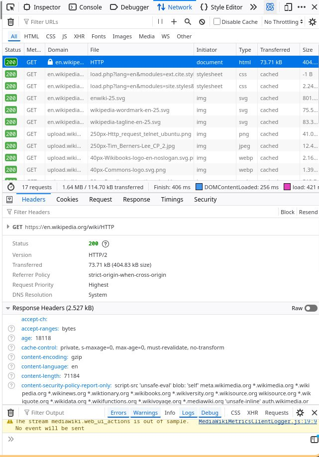
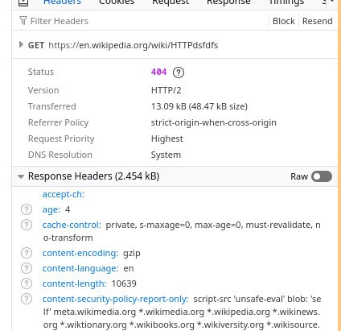
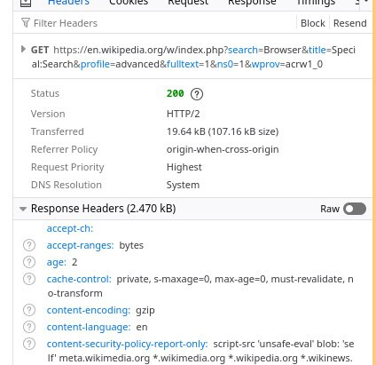
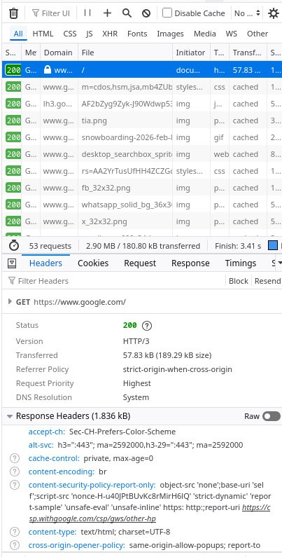

*  Йоу йоу йоу первая лаба по пхп

Значит так сёдня мы порешаем че у нас по запросам по ответам и вообще
будет классно ребята подписываемся и ставим звездочки на мой крутой
репо!!!

Короче открыл я сайт Wikipedia (not Epstein edition), и получил такие вот запросики:

** Изучаем запросик!

В нашем запросе пристуствует много всего, поэтому пройдемся по пунктам из лабы

- Url запроса
  https://en.wikipedia.org/HTTP
- Метод запроса - GET
  Потому что нам нужно получить(GET) данные со страницы. Абсолютно логично.
- Статус ответа - 200
  Значит мы потерпели успех. Все вернулось, все удачно, аллиллуйя!!!
- Заголовки запроса!
  - Host: en.wikipedia.org
    К какому серверу мы обращаемся.
  - User-Agent: Mozilla/5.0 (X11; Linux x86_64; rv:140.0) Gecko/20100101 Firefox/140.0
    Какой у нас браузер, устройство и кто мы по масти
  - Accept: text/html, application/xhtml+xml, application/xml
    Какие виды ответа мы ожидаем
  - Accept-Encoding: gzip, br, zstd
    Какие алгоритмы шифрования мы поддерживаем
- Заголовки ответа!!!!
  - content-type: text/html; charset=UTF-8
    Какой тип данных нам прислали
  - content-length: 71184
    Сколько байт мы получили
  - content-encoding: gzip
    Как страничичка сжата
- Тела запроса нет ура
- Тело ответа - наша хетемеле страничка

  
Для запроса https://en.wikipedia.org/wiki/HTTPdsfdfs
Мы получаем статус ответа 404, что значит, что ничего не найдено. кринж.

** Разбираем запрос с поиском.

- Url запроса
  https://en.wikipedia.org/w/index.php?search=Browser&title=Special:Search&profile=advanced&fulltext=1&ns0=1&wpnovacrwl=0

- Метод
  GET
  Используется для получения страницы результатов поиска.

- Версия
  HTTP/2

- Статус
  200
  Запрос выполнен успешно, страница возвращена.

- Параметры запроса
  Переданы через строку запроса в URL после символа ?.
  Пары имеют формат ключ=значение и разделяются символом &.

  search=Browser
  title=Special:Search
  profile=advanced
  fulltext=1
  ns0=1
  wpnovacrwl=0

- Заголовки ответа (основные)
  content-type: text/html; charset=UTF-8
  content-encoding: gzip
  cache-control: private, max-age=0
  content-language: en

- Тело запроса
  Отсутствует, так как используется GET.

- Тело ответа
  HTML страница с результатами поиска.

** Разбираем другой запросик!

Для этого задания мы сделали запрос к веб-сайту google.com

- Url запроса  
  https://www.google.com/
- Метод запроса — GET  
  Потому что мы просто получаем (GET) главную страницу, ничего не отправляем и ничего не меняем. Классика жанра.
- Статус ответа — 200  
  Значит всё прошло успешно: сервер жив, страница нашлась, HTML прилетел. Победа
- Заголовки запроса
  - Host: www.google.com  
    К какому серверу мы обращаемся.
  - User-Agent: Mozilla/5.0 (X11; Linux x86_64; rv:140.0) Gecko/20100101 Firefox/140.0  
    Кто мы такие: браузер, ОС и вся родословная.
  - Accept: text/html, application/xhtml+xml, application/xml  
    Какие форматы ответа нас устраивают.
  - Accept-Encoding: gzip, deflate, br, zstd  
    Какие алгоритмы сжатия мы умеем понимать.
- Заголовки ответа
  - content-type: text/html; charset=UTF-8  
    Нам прислали HTML-страницу.
  - content-encoding: br  
    Страница сжата с помощью Brotli.
  - cache-control: private, max-age=0  
    Кешировать надолго нельзя, всё серьёзно.
- Тела запроса нет — ура
- Тело ответа — HTML-код главной страницы Google

** Составление запросов

*** GET запрос
**** Команда curl
#+begin_src sh
curl -X GET http://sandbox.usm.com \
  -H "User-Agent: Pustovoi Alexei"
#+end_src

**** Что такое User-Agent
User-Agent это заголовок HTTP запроса.
Он сообщает серверу кто делает запрос.
Обычно содержит информацию о клиенте, браузере или приложении.
Используется для логирования, статистики и совместимости.

*** POST запрос

**** Команда curl
#+begin_src sh
curl -X POST http://sandbox.usm.com/cars \
  -H "Content-Type: application/x-www-form-urlencoded" \
  -d "make=Toyota&model=Corolla&year=2020"
#+end_src

**** Другие методы HTTP
- GET     получение данных с сервера
- POST    отправка данных и создание ресурса
- PUT     полная замена ресурса
- PATCH   частичное обновление ресурса
- DELETE  удаление ресурса
- HEAD    получение только заголовков
- OPTIONS получение списка доступных методов

*** PUT запрос

**** Команда curl
#+begin_src sh
curl -X PUT http://sandbox.usm.com/cars/1 \
  -H "User-Agent: Pustovoi Alexei" \
  -H "Content-Type: application/json" \
  -d '{
    "make": "Toyota",
    "model": "Corolla",
    "year": 2021
  }'
#+end_src

**** Разница между PUT и PATCH
PUT полностью заменяет ресурс.
PATCH изменяет только отдельные поля ресурса.

*** Возможные ответы сервера

Запрос:
POST /cars HTTP/1.1

**** Коды состояния HTTP
- 200 OK
  Запрос успешно обработан, ресурс обновлен.

- 201 Created
  Ресурс успешно создан.

- 400 Bad Request
  Неверные данные или ошибка в формате запроса.

- 401 Unauthorized
  Пользователь не аутентифицирован.

- 403 Forbidden
  Нет прав доступа к ресурсу.

- 404 Not Found
  Ресурс или путь не найден.

- 500 Internal Server Error
  Внутренняя ошибка сервера.
